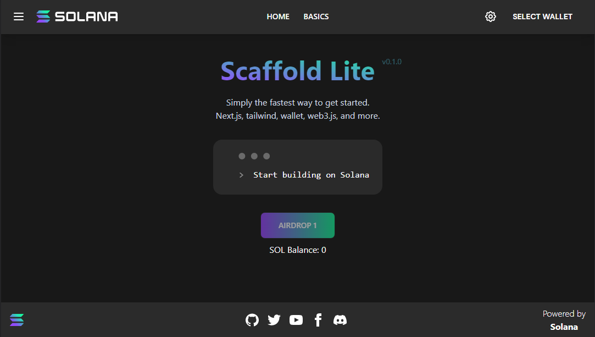

  

# Solana dApp Scaffold Next

  

The Solana dApp Scaffold repos are meant to house good starting scaffolds for ecosystem developers to get up and running quickly with a front end client UI that integrates several common features found in dApps with some basic usage examples. Wallet Integration. State management. Components examples. Notifications. Setup recommendations.

  

Responsive | Desktop

:-------------------------:|:-------------------------:

 | 

  

## Getting Started

  

This is a [Next.js](https://nextjs.org/) project bootstrapped with [`create-next-app`](https://github.com/vercel/next.js/tree/canary/packages/create-next-app).

  

The responsive version for wallets and wallet adapter may not function or work as expected for mobile based on plugin and wallet compatibility. For more code examples and implementations please visit the [Solana Cookbook](https://solanacookbook.com/)

  

## Installation

  

```bash

npm install

# or

yarn install

```

  

## Build and Run

  

Next, run the development server:

  

```bash

npm run dev

# or

yarn dev

```

  

Open [http://localhost:3000](http://localhost:3000) with your browser to see the result.

  

You can start editing the page by modifying `pages/index.tsx`. The page auto-updates as you edit the file.

  

[API routes](https://nextjs.org/docs/api-routes/introduction) can be accessed on [http://localhost:3000/api/hello](http://localhost:3000/api/hello). This endpoint can be edited in `pages/api/hello.ts`.

  

The `pages/api` directory is mapped to `/api/*`. Files in this directory are treated as [API routes](https://nextjs.org/docs/api-routes/introduction) instead of React pages.

  

## Features

  

Each Scaffold will contain at least the following features:

  

```

Wallet Integration with Auto Connec / Refresh

  

State Management

  

Components: One or more components demonstrating state management

  

Web3 Js: Examples of one or more uses of web3 js including a transaction with a connection provider

  

Sample navigation and page changing to demonstate state

  

Clean Simple Styling

  

Notifications (optional): Example of using a notification system

  

```

  

A Solana Components Repo will be released in the near future to house a common components library.

  
  

### Structure

  

The scaffold project structure may vary based on the front end framework being utilized. The below is an example structure for the Next js Scaffold.

```

├── public : publically hosted files

├── src : primary code folders and files
# NFT-Marketplace-Smart-Contract

  

NFT-MArketplace Smart Contract users can set royalty of NFT, buy with ERC20 token & 2.5% platform fees.

  

## Important Step

  

```bash

create .env file in root directory.

```

  

```bash

API_URL = "https://eth-ropsten.alchemyapi.io/v2/your-api-key"

PRIVATE_KEY = "YOUR-METAMASK-PRIVATE_KEY"

ETHERSCAN_API_KEY = "YOUR-ETHERSCAN_API_KEY"

  

```

  

-Get Your API Key

  

- [Alchemy](https://alchemy.com/?r=36af7883c4699196)

  

-Get Your Rinkeby Faucet

  

- [Rinkeby Faucet](https://faucets.chain.link/rinkeby)

  

## NPM Packages

  

- [Openzeppelin](https://www.npmjs.com/package/@openzeppelin/contracts)

- [Hardhat-Ethers](https://www.npmjs.com/package/hardhat-ethers)

- [Chai](https://www.npmjs.com/package/chai)

- [Ethers](https://www.npmjs.com/package/ethers)

- [Ethereum-Waffle](https://www.npmjs.com/package/ethereum-waffle)

- [Dotenv](https://www.npmjs.com/package/dotenv)

- [Hardhat-Etherscan](https://www.npmjs.com/package/hardhat-etherscan)

  

## Tech Stack

  

- [Node](https://nodejs.org/en/)

- [Hardhat](https://hardhat.org/)

- [Solidity](https://docs.soliditylang.org/)

- [Openzeppelin](https://openzeppelin.com/)

  

## Run Locally

  
Go to the project directory

  

```bash

cd nft-marketplace-smart-contract-

```

  

Install dependencies

  

```bash

npm install

```

  

Compile

  

```bash

npx hardhat compile

```

  

Test

  

```bash

npx hardhat test

```

  

Deploy

  

```bash

node scripts/deploy.js

```

  

Deploy on Rinkeby

  

```bash

npx hardhat run scripts/deploy.js --network rinkeby

```

  

Verify Contract

  

```bash

npx hardhat verify --network rinkeby <YOUR_CONTRACT_ADDRESS>

```

  

Help

  

```bash

npx hardhat help

```


│ ├── components : should house anything considered a resuable UI component

│ ├── contexts` : any context considered reusable and useuful to many compoennts that can be passed down through a component tree

│ ├── hooks` : any functions that let you 'hook' into react state or lifecycle features from function components

│ ├── models` : any data structure that may be reused throughout the project

│ ├── pages` : the pages that host meta data and the intended `View` for the page

│ ├── stores` : stores used in state management

│ ├── styles` : contain any global and reusable styles

│ ├── utils` : any other functionality considered reusable code that can be referenced

│ ├── views` : contains the actual views of the project that include the main content and components within

style, package, configuration, and other project files

  

```

  

## Contributing

  

Anyone is welcome to create an issue to build, discuss or request a new feature or update to the existing code base. Please keep in mind the following when submitting an issue. We consider merging high value features that may be utilized by the majority of scaffold users. If this is not a common feature or fix, consider adding it to the component library or cookbook. Please refer to the project's architecture and style when contributing.

  

If submitting a feature, please reference the project structure shown above and try to follow the overall architecture and style presented in the existing scaffold.

  

### Committing

  

To choose a task or make your own, do the following:

  

1. [Add an issue](https://github.com/solana-dev-adv/solana-dapp-next/issues/new) for the task and assign it to yourself or comment on the issue

2. Make a draft PR referencing the issue.

  

The general flow for making a contribution:

  

1. Fork the repo on GitHub

2. Clone the project to your own machine

3. Commit changes to your own branch

4. Push your work back up to your fork

5. Submit a Pull request so that we can review your changes

  

**NOTE**: Be sure to merge the latest from "upstream" before making a

pull request!

  

You can find tasks on the [project board](https://github.com/solana-dev-adv/solana-dapp-next/projects/1)

or create an issue and assign it to yourself.

  
  

## Learn More Next Js

  

To learn more about Next.js, take a look at the following resources:

  

- [Next.js Documentation](https://nextjs.org/docs) - learn about Next.js features and API.

- [Learn Next.js](https://nextjs.org/learn) - an interactive Next.js tutorial.

  

You can check out [the Next.js GitHub repository](https://github.com/vercel/next.js/) - your feedback and contributions are welcome!

  

## Deploy on Vercel

  

The easiest way to deploy your Next.js app is to use the [Vercel Platform](https://vercel.com/new?utm_medium=default-template&filter=next.js&utm_source=create-next-app&utm_campaign=create-next-app-readme) from the creators of Next.js.

  

Check out our [Next.js deployment documentation](https://nextjs.org/docs/deployment) for more details.